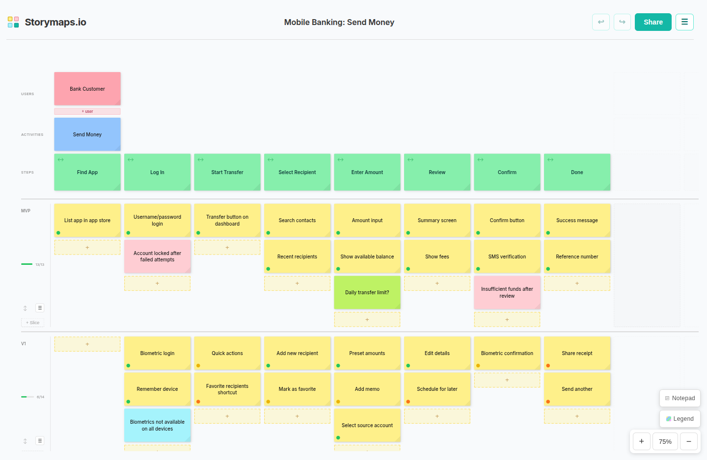

# Storymaps.io

A free, open-source user story mapping tool with real-time collaboration.



## What is User Story Mapping?

User story mapping is a technique for organising stories into a visual map that shows the entire product life cycle at a glance. It helps teams build a shared understanding of what a product does, who it serves, how it delivers value, how it was built, and where it's going next. It's essentially a comprehension tool which shows you the product vision and evolution in a single diagram. 

If a sprint shows you the tree, a story map shows you the forest.


It's not a replacement for Jira, Trello, Phabricator, or any other project management tool. It's the missing layer that sits alongside them. Your issue tracker tells you what work needs doing. Your story map tells you why it matters and where it fits.

### Why It Matters

Agile workflows like Scrum and Kanban are great at showing you what you're building right now. They're not always great at showing you how it connects to everything else. Long-running projects often follow the same pattern: they start with energy, vision and shared understanding, and six months later that coherent picture of the product has been replaced by a giant backlog. Everyone knows what their tickets are. Nobody can point to a single place that shows how all that work fits together as a product. The vision that started the project isn't lost because people forgot it. It's lost because nothing in the workflow preserves it.

A story map preserves it. One diagram that shows who the users are, what journey they take, what features support each step, and what's been delivered versus what's planned. You can point at a section and say 'we've got the same approval flow duplicated across three journeys, let's consolidate it' or 'there's nothing between checkout and delivery, we're missing the order confirmation step.' You can draw a line across the map and say 'everything above this is V1, let's push biometrics and reporting to V2.' The product vision stays visible, not as a document nobody reads, but as a living artifact the team works from, refers back to, and can update as the product evolves.

###   Agile Backlogs Hide Complexity. Story Maps Expose It.

By mapping out the user journey upfront, you can instantly spot functional gaps. For example, say you're building an online store for a local sign shop. You plan out steps: "Browse Designs" → "Customise Text" → "Confirm Dimensions" → "Approve" → "Checkout". That seems like a sensible linear flow in your backlog.

You start implementation, work through the first three stages, and hit "Approve", only to realise you forgot to account for what happens if the customer's design isn't approved. Implementation pauses. After discussing it with stakeholders, you add "Revise Design" → "Revise Dimensions" → "Re-approve". Your workload just went from five steps to eight, mid-sprint, sound familiar?.

This kind of hidden complexity surfaces repeatedly in projects. It's nobody's fault, but it impacts everyone: scope creep, late deliveries, and uncomfortable conversations about why things are taking longer than expected.

With story mapping, everyone is in the room during the mapping session. The question "What happens if they don't approve?" surfaces early because the team is walking through the user's journey together, step by step. You have the conversation before implementation starts, capture it in the map, and reduce disruptions while building shared understanding across the team.  Flat Backlogs Hide Complexity. Story Maps Expose It.

### User Story Mapping Structure:
- **Users** - Who are the users? e.g. first-time shopper
- **Activities** - What are they trying to achieve? e.g. find a product
- **Steps** - The journey they take to achieve their goals from left to right e.g. search -> browse -> compare
- **Tasks** - The work to support each step e.g. keyword search, category filters, compare products
- **Slices** - Horizontal groupings for releases (MVP, v1, v2, etc.)

## App Features

### Story Mapping
- **Users** - Add context rows showing who does what
- **Activities & Steps (Backbone)** - Define activities and steps representing the user journey left-to-right
- **Tasks** - Add task cards under each step to break down the work
- **Release Slices** - Group tasks horizontally into releases or priorities (MVP, V1, V2, etc.)
- **Status Indicators** - Mark tasks as done, in-progress, planned, or blocked with progress tracking per slice
- **Legend** - Define colour-coded card categories (e.g. Tasks, Notes, Questions, Edge cases)
- **Colours & Links** - Customise card colours and add external URLs to your existing task management tools
- **Drag & Drop** - Reorder cards, columns, and slices

### Collaboration
- **Real-time Collaboration** - Multiple users can edit the same map simultaneously with conflict-free merging powered by Yjs CRDTs
- **Collaborative Notepad** - Shared notepad for team notes, decisions, and questions that syncs in real-time
- **Live Cursors** - See other users' cursors and drag operations in real-time
- **Live Viewer Count** - See how many people are viewing the map
- **Shareable URLs** - Each map gets a unique URL for easy sharing
- **Lock Maps** - Password-protect maps to prevent edits; unlock anytime to resume editing

### Tools
- **Export to Jira** - Export your map as epics and stories to Jira via CSV import or the REST API
- **Export to Phabricator** - Export your map as tasks and subtasks to Phabricator via the Maniphest API
- **Import/Export JSON** - Save and load story maps as JSON files
- **Print / PDF** - Print your story map or save as PDF
- **Undo/Redo** - Ctrl+Z / Ctrl+Y to undo and redo changes
- **Infinite Canvas** - Ctrl+scroll to zoom, right-click drag to pan
- **Local Storage** - Automatically saves your work
- **Samples** - Load example story maps to learn the methodology

## Architecture

The app is a single Node.js server (`server.js`) that handles:
- **WebSocket** - Real-time collaboration via y-websocket
- **Static files** - Serves the client app from `public/` and `src/`
- **REST API** - Lock state (`/api/lock/:mapId`) and stats (`/api/stats`)

### Data Storage
- **LevelDB** - Yjs document persistence in `yjs-data/`
- **SQLite** - Map index with names and timestamps (`yjs-data/maps.db`)
- **JSON files** - Lock state (`yjs-data/locks.json`) and counters (`yjs-data/stats.json`)

### Client
The client has no build step — ES modules are loaded directly from `src/`. Third-party libraries (Yjs, CodeMirror) are vendored as pre-built bundles in `public/vendor/`.

## Self-Hosting

### Prerequisites
- Docker and Docker Compose
- A domain with DNS pointing to your server

### Quick Start

1. Clone the repo
2. Build the Docker image:
   ```bash
   docker compose build
   ```
3. Edit the `Caddyfile` with your domain:
   ```
   yourdomain.com {
       reverse_proxy app:8080
   }
   ```
4. Start the services:
   ```bash
   docker compose up -d
   ```

Caddy automatically provisions HTTPS certificates via Let's Encrypt. Data persists in the `yjs-data/` host-mounted volume.

### Running Locally (Development)

```bash
npm install
npm start
```

The server starts on `http://localhost:8080`.

## Usage
1. Visit [storymaps.io](https://storymaps.io) or self-host your own instance
2. Click **New Story Map** or try a sample to get started
3. Click **+** to add steps (columns) to the backbone
4. Click **+** in a column to add tasks
5. Click **+ Add Slice** to create release groupings
6. Click the **...** menu on cards to set colours, status, or links
7. Drag tasks to reorder or move between columns
8. Use the **Legend** to define card categories and colour-code your map
9. Use the **Notepad** to capture team notes and decisions
10. Click **Share** to copy the URL and collaborate with others
11. Use **Menu → Lock Map** to password-protect the map from edits
12. Use **Ctrl+Z** / **Ctrl+Y** to undo and redo changes
13. Use **Ctrl+scroll** to zoom, **right-click drag** to pan
14. Use **Menu → Export** to save as JSON or export to Jira/Phabricator
15. Use **Print** to save as PDF

## Support
If you find this tool useful, consider [buying me a coffee](https://buymeacoffee.com/jackgleeson). It goes towards server costs and helps me keep the app running.

## Credits
- Thanks to Jeff Patton for pioneering user story mapping. Learn more: [Jeff Patton's Story Mapping](https://jpattonassociates.com/story-mapping/)
- Real-time collaboration powered by [Yjs](https://yjs.dev/) CRDTs
- Drag and drop powered by [SortableJS](https://sortablejs.github.io/Sortable/)
- Collaborative notepad powered by [CodeMirror 6](https://codemirror.net/)

## License
AGPL-3.0 — see [LICENCE](LICENCE) for details.
