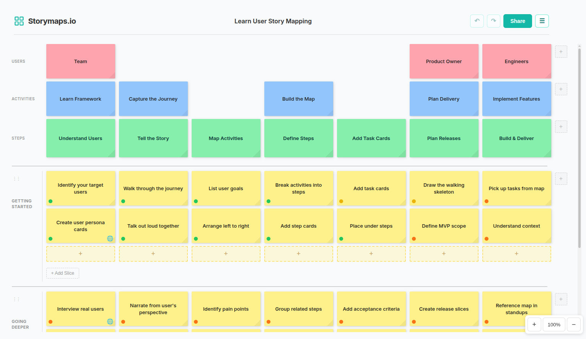

# Storymaps.io

A simple, interactive user story mapping tool built with vanilla JavaScript.

## What is User Story Mapping?
User story mapping is a technique for organising user stories into a visual map that helps teams understand the big picture of a software project, feature, or product. More importantly, it helps teams agree on what the product should do and how it should be built. It acts as a canonical source of information for the team that can be referenced throughout the project.

It's not a replacement for Jira, Trello, Phabricator, or any other project management tool. Instead, it's to be used alongside them to visualise the big picture of the work being done and keep track of progress. Think of it as a visual way to organise your backlog in a way that makes sense to everyone.

### The Power of the Big Picture
User story mapping transforms a flat agile backlog into a living visual narrative that ensures your team never loses sight of the user's journey. While traditional tools are excellent for tracking individual tasks, they often obscure the "why" behind the work.

By mapping out the user experience upfront, you can instantly spot functional gaps. For example, if you're building an online store for a local sign shop that makes custom signs, you might plan steps like "Browse Designs", "Customise Text", "Review Proof", "Approve Proof", and "Checkout", but forget the revision cycle needed if the proof isn't approved ("Request Changes" → "Revise Design" → "Re-send Proof"). In a flat backlog, that scenario can stay hidden until someone starts implementing the proof approval work, leading to unplanned extra work, UI changes, scope creep, and all those fun things we see in software projects. In a story map, the question "What happens if they don't approve?" surfaces early, exposing the missing path in the customer's journey.

### User Story Mapping Structure:
- **Users** - Who are the users? e.g. first-time shopper
- **Activities** - What are they trying to achieve? e.g. find a product
- **Steps** - The journey they take to achieve their goals from left to right e.g. search -> browse -> compare
- **Tasks** - The work to support each step e.g. keyword search, category filters, compare products
- **Slices** - Horizontal groupings for releases (MVP, v1, v2, etc.)

## App Features
- **Real-time Collaboration** - Multiple users can edit the same map simultaneously
- **Live Viewer Count** - See how many people are viewing the map in real-time
- **Shareable URLs** - Each map gets a unique URL for easy sharing
- **Users** - Add context rows showing who does what
- **Activities & Steps (Backbone)** - Define activities & steps representing the user journey left-to-right
- **Tasks** - Add task cards under each step to break down the work
- **Release Slices** - Group tasks horizontally into releases or priorities
- **Status Indicators** - Mark tasks as done, in-progress, or planned
- **Colours & Links** - Customise card colours and add external URLs to your existing task management tools
- **Drag & Drop** - Reorder cards and slices
- **Undo/Redo** - Ctrl+Z/Ctrl+Y to undo and redo changes
- **Zoom Controls** - Zoom out to see the full board, zoom in for detail
- **Print / PDF** - Print your story map or save as PDF
- **Import/Export** - Save and load story maps as JSON files
- **Local Storage** - Automatically saves your work
- **Samples** - Load example story maps to learn the framework

## Self-Hosting Setup

This app uses Firebase for real-time collaboration and cloud storage. To run your own instance:

1. Create a Firebase project at [console.firebase.google.com](https://console.firebase.google.com/)
2. Enable Firestore Database in your project
3. Enable Realtime Database in your project (for live viewer count)
4. Set up App Check with reCAPTCHA v3 at [console.cloud.google.com/security/recaptcha](https://console.cloud.google.com/security/recaptcha)
5. Copy `config.example.js` to `config.js`
6. Add your Firebase credentials, database URL, and reCAPTCHA site key to `config.js`
7. Serve the files with any static web server

Note: Data is always saved to local storage. Real-time collaboration and cloud sync require Firebase.

## Usage
1. Visit [storymaps.io](https://storymaps.io) or run locally with `npx serve -s` (SPA mode for client-side routing)
2. Click **New Story Map** or try a sample to get started
3. Click **+** to add steps (columns) to the backbone
4. Click **+** in a column to add tasks
5. Click **+ Add Slice** to create release groupings
6. Click the **...** menu on cards to set colours, status, or links
7. Drag tasks to reorder or move between columns
8. Click **Share** to copy the URL and collaborate with others
9. Use **Ctrl+Z** / **Ctrl+Y** to undo and redo changes
10. Use zoom controls (bottom-right) to zoom in/out
11. Use **Print** to save as PDF, **Export** to save as JSON

## Support
If you find this tool useful, consider [buying me a coffee](https://buymeacoffee.com/jackgleeson). Donations help cover Firebase hosting costs to keep the real-time collaboration features running.

## Credits
- Thanks to Jeff Patton for pioneering user story mapping. Learn more: [Jeff Patton's Story Mapping](https://jpattonassociates.com/story-mapping/)
- Drag and drop powered by [SortableJS](https://sortablejs.github.io/Sortable/)

## License
MIT
